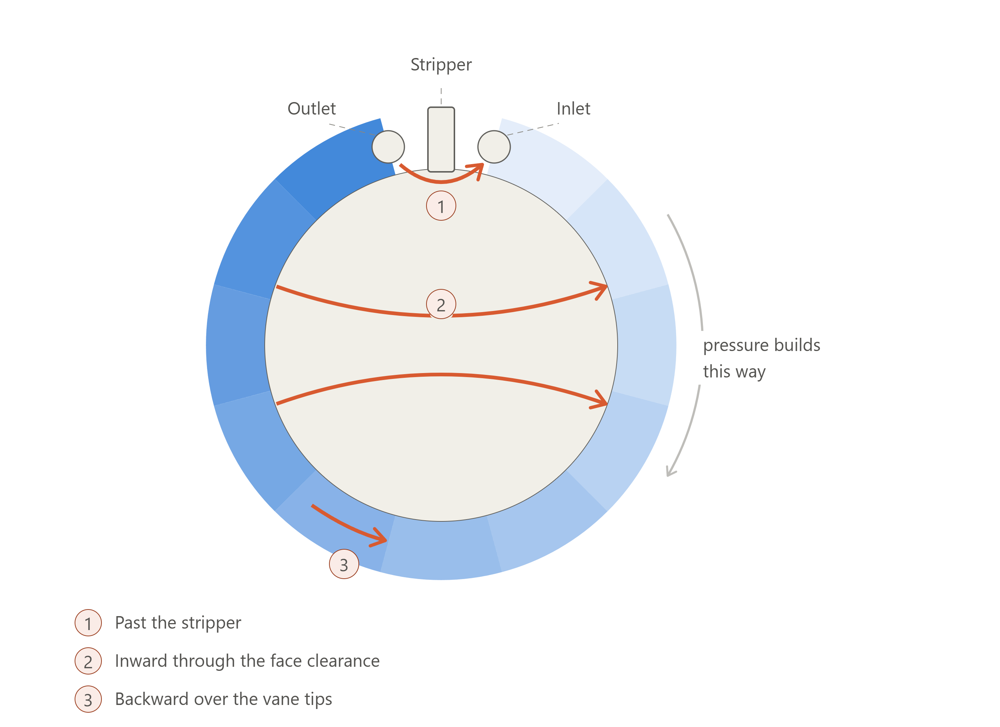

# A1 – Create Portfolio

## Objective

The first week's task is to build the framework of a website that hosts our engineering portfolios. To create a meaningful engineering portfolio we first need to look at what the key components would be, so this assignment has us analyze two pre-existing engineering portfolios against four criteria:

1. **Navigability** — can a reader find a particular thing on the website within 60 seconds?
2. **Reproducibility** — does the documentation contain enough information that a colleague could reproduce the work without asking a question?
3. **Evidence of reasoning** — does the portfolio show how decisions were made, or only what the final answer was?
4. **Professional tone** — does the language meet the standard of a document you would hand to an employer?

The goal of this exercise is to be able to apply those critiques to my own page as I build it.

Once the website critiques are done, we must find a household item and analyze its function and the design that achieves it. This will put us in the frame of mind to make similar design decisions as the class progresses. We are required to state the model and its variables, as well as one assumption that makes the model valid for its purpose. As we analyze the product we will take pictures of each component and describe its function and the mechanical design that achieves it. Finally we will find the patent information and expand upon one design decision that the original engineer made.

Once the analysis is done, we must decide how to make the website our own. There are three avenues we will take to do so:

1. **Homepage identity** — decide what a visitor needs to know immediately to understand the purpose of this portfolio, its contents, and its organizational structure.
2. **One intentional customization** — make one modification to the template, then explain what was changed and why it better fits the requirements.
3. **Documentation standard** — write one sentence that explains the standard I will hold myself to when submitting assignments into the portfolio.

The final portion of this assignment is to communicate. The part of the website which will have an answer communicated is the About Me section. I will fill it out with information such as who I am as an engineer, what about engineering interests me, and what type of engineer I would like to become.

Hopefully at the end of the assignment I will have a functional webpage, a thorough analysis of other portfolios and of a product I hope to one day have the skills to replicate, and an About Me section that explains my objectives and purpose in becoming a mechanical engineer at UNC Charlotte.

## Decide

### Homepage Identity

My homepage will contain a brief view of my assignments with clickable links to access them. I will also communicate the purpose of sophomore design and its context within my path to becoming a mechanical engineer, in order to get the point of the webpage across to the reader. 

### Intentional Customization

One intentional homepage change I will make is adding a part of the page to have pictures referencing each project and a clickable link to access the full writeup of each of them. I would like this to automatically update as I add pictures and content to each assignment. When one hovers over the image, I would like for a side table to pop up showing when I did the project, the things I've learned or practiced with the assignment, and the amount of time it took me.

### Documentation Standard

My documentation standard will be a thorough writeup that summarizes the work I put into the project. I will go through my work and notes in relation to the objective and communicate the thought process at each step, as well as issues I ran into while completing it.

## Analyze

### Website 1 — Thanh Tran

<https://thanhvtran.com/>

It is easy to see from just the homepage that Thanh Tran is an incredibly talented mechanical engineer with a sense of humor. While his joking about being addicted to machining and being useless during his time in Washington could be perceived as unprofessional, I think it gives important insight into who Tran is.

When industry professionals are making hiring decisions they want to find someone who will be a good fit for the team, not just with their technical abilities but also with their personality. Across all of the companies that Tran has worked for, his team would have had to work together and effectively communicate hundreds of differences of opinion. Those conflicts go over a lot smoother when they are with someone enjoyable to work with, and therefore individual personality plays into team productivity a lot more than many would expect.

Tran's website is very easy to navigate. He has five important tabs at the top of his page that adequately summarize the different parts of his website: Home, Resume, Projects, About, and Contact. His resume is downloadable and accessible after one click. Following that same mentality, all of his projects are visible after one click, with sorting elements at the top of the page to pick between internship projects, personal projects, and student team projects. When you click on one project and read through the summary, you stumble upon direct links at the bottom of the page to take you to his other projects. This makes it easier to go through his page without going back and forth between tabs — a nice touch.

His personal projects provide some detail, explaining some issues that arose and the solutions to them. This wasn't the case for his internship projects due to contractual obligations to remain vague; however, he outlined the projects he was a part of and what they taught him. I think he felt that engineers looking at his website could understand the problem space themselves and could therefore see why he made the decisions he did. He is catering to a very well versed audience rather than a random reader.

Potential employers at the companies he is trying to work for might appreciate this, as they have hundreds of applicants and it is important to be able to see the skills gained from projects without reading a three page justification for each individual decision. An engineer cannot reproduce each project with his explanations alone, but that is not the intention — it is a resume in the form of a website, not a forum explaining how to do each project.

Thanh Tran has worked at Google as a product design engineer since January of 2023, and I feel certain that his intuitive website outlining relevant experience helped him secure that position (as well as the fact that you would know each of the companies he worked for by their logo alone).

### Website 2 — Javier Sanchez Ramirez

<https://javiersanchezramirez.github.io/>

Javier Ramirez's website is a bit less minimalistic than Thanh Tran's. This doesn't take away from the user experience, it just takes a little bit longer to navigate from place to place within it. I like that the whole website is one scrollable page, with each tab at the top just scrolling you down to where the subtitle is. You can scroll through if you are just looking for things he has done, but you can also click on a tab at the top if you are searching for a particular thing. He also utilizes sorting features to see projects of a certain nature, which I quite like as it helps the reader narrow down their search.

The skills section seems a bit vague. The purpose of it is clear, but there are bars showing the level of proficiency in each skill which seem to have no standard of rating. You can see what skills he feels most confident in; however, I would be surprised if he really knows about 75 percent of all there is to know about machine design, for example.

This is a possible area of critique in the professionalism category, as it is important to communicate what you have learned but also important to avoid coming across as overconfident and as if you have very little left to learn. Someone who is honest about their skill level will be much more eager to improve on the job than someone who feels they are a master. I say this as I am critiquing a website that is much more polished than mine likely will be, but nevertheless it is the case.

Ramirez's projects, similarly to Tran's, feature very little description, although pictures show the work that went into them. The point of the projects being on the website is not to replicate them but to show what areas of interest Ramirez has dived into in his professional ventures. The tone is professional throughout the brief descriptions, and it still communicates the purpose of the project. It would have been nice if the skills gained or developed through each project were stated, however an engineer will be able to tell without it being laid out in front of them.

### BMW E30 Regenerative Fuel Pump Cartridge

  
  
  

#### Design Requirements

This pump is a generic one that failed on me due to a faulty check valve, however there are still a lot of good design decisions within it. Automotive parts have a lot of inherent requirements in order to function as expected. This specific part must:

- Work in temperatures ranging from −40 °F (freezing temp of low quality gasoline) to 140 °F (upper end of in-tank gas temp with high ambient temps and heat soak from the engine)
- Last for thousands of hours and miles
- Provide continuous 3 bar output and about 2.5 bar at the fuel rail
- Draw less than 7.5 A
- Have some amount of resistance to sludge buildup due to low quality gas
- Provide sufficient volumetric flow rate for 60 L/h injector output
- Maintain > 2 bar of fuel pressure after shutoff (where this pump failed)

Even with these specifications there is a lot of room for an engineer's discretion. The engineers behind this product had a head start, as the OE part was already produced and available to reference, so they didn't stray too far from that. In order to understand the problem space that the engineers who designed this pump were in, we must first understand the decisions and designs of the engineers who made the original pump.

#### The Original Two-Pump Solution

  
  

The early model BMW E30 had a two pump solution, with a low pressure sending unit feeding a high pressure pump. This solved problems of the time. In the early 80's, regenerative turbine pumps had the same flaws they do today, but a lack of refinement made them much worse. The main problems associated with them are failures when cavitation occurs, an inability to suck fluid through a feeding pipe, and a need for tight tolerances to get the fluid behavior desired.

The cavitation and the inability to suck fluid through a pipe are two results of the same problem. In order to suck fluid through a pipe, there must be a vacuum at the inlet. This vacuum is exactly what causes cavitation in gasoline, and it occurs right where the pump should be most effective, due to the speed differential between the turbine and the gasoline.

In order to solve this problem, BMW and many other manufacturers in the mid to late 80's used a low pressure feed pump to ensure the fluid entering the pump was above cavitation pressure. Having fluid fed into the high pressure pump reduced the risk of vacuum creating low pressure zones (about 7 psi worst case for gasoline). The secondary pump changed the means of supply from relying upon vacuum at the inlet to a direct feed with higher, healthier pressure.

This also helps reduce the effect of a partially clogged filter. Debris getting into the pump would ruin it quickly, so there has to be a filter placed before the inlet. When that filter gets partially clogged, relying upon suction from the pump would result in too low of a pressure between filter and inlet, and thus cause liquid gas to turn into gas vapor.

#### How a Regenerative Turbine Works

  
  

To understand why cavitation is such a big issue, we must first understand how a regenerative turbine works. I have found some useful graphics from HTC Pumps (images 1, 3) and Roth Pump Company (image 2).

Regenerative pumps rely upon cycling fluid in a helical path, slowly building pressure as it flows around the internal channel. You can see in image 1 the helical path that the fluid flows in. Each time the fluid flows back into a vane of the turbine, it picks up speed and is flung outwards again into the channel. It is this that gives the pump its name.

If you track one drop of fuel from inlet to outlet, it interacts with dozens of turbine vanes, picking up a tiny bit of pressure and momentum every time, but it still spends much of its time in the channel where the vanes have minimal influence on it.

This flow pattern gives regenerative pumps their main benefit for an application like this: a consistent pressure output. Because fluid moves somewhat independently of the turbine, the pressure gradient is much more linear throughout the path from inlet to outlet. Regardless of the radial offset of the upcoming vane, it will have the same output pressure.

That part about fluid moving slower than the turbine has its drawbacks, though. Regenerative pumps are less efficient than typical pumps, largely because fluid only interacts with the turbine momentarily — it's not "fixed" to it. Attached below is a rough graph that I had Claude generate for me to show the buildup of pressure in a regenerative pump. This graph also highlights the drop in performance associated with poor or degraded tolerances.

<figure markdown="span">

  Healthy — tight face clearance
  Worn — open face clearance
  3.0 bar target

  <canvas id="regenPressure" role="img" aria-label="Line chart of fuel pressure against angular position around a regenerative turbine pump channel. A healthy pump rises steeply at first and flattens toward 3.0 bar at the outlet at 330 degrees. A worn pump starts with the same initial slope but flattens far earlier and reaches only about 1.8 bar.">Pressure by angle from inlet: healthy pump reaches 3.0 bar at 330 degrees; worn pump reaches only 1.8 bar.</canvas>

<figcaption>Pressure buildup around the channel of a regenerative pump, inlet to outlet. Qualitative illustration, not measured data.</figcaption>
</figure>

Alternative styles of pumps contain the fluid in just one vane as it rotates and rely upon centrifugal force alone to generate pressure. There are benefits to containing fluid in one vane through the full revolution: it's better at sucking fluid in, cavitation reduces performance less as it's isolated to one pocket, and bad tolerancing has less of an effect on the function of the pump.

The major issue for an application like this is the pulse of pressure that is created every time a vane comes around to the outlet. Consistency is important for predictable performance. Injector 1, open for a fraction of a second at 2.5 bar, would flow a vastly different amount of gas than injector 2 opened right after it, once you account for a pressure drop to 2.3 bar while waiting for another pressure pulse from the pump. Regenerative pumps solve this by maintaining consistent pressure and feed at all times.

Fractions of a second don't sound like much, but at 6500 rpm there are roughly 54 injections per second per injector, with each injection lasting just 18 ms at 100 percent duty cycle, or around 15 ms with stock E30 duty cycles hovering around 85 percent.

Hopefully this understanding helps make the issues that come with cavitation and inconsistent pressure and flow apparent. A pocket of gas vapor in one of the channels collapses the buildup of pressure along the helical path. It's like having an aluminum driveshaft from transmission to differential that has a fluid coupler specced for a radiator fan in the middle of it. The resistance and ability to transmit force is much lower in the fluid coupler (vapor pocket) than in the aluminum shaft (liquid gas). Because of this, the pressure at the output plummets, as it would at the differential.

#### Flow Rate and Internal Leakage

The other output requirement is a volumetric flow rate adequate enough for a maintained injector consumption of 60 L/h. BMW holds that a pump has gone bad if its output falls below 105 L/h. This pump is rated for 130 L/h, giving it a roughly 20 percent degradation threshold, which leaves room for parts to wear.

This sounds like plenty of room for error, but a poorly made pump would blow through it in no time — for example, through fluid leaking out of the intended path inside the pump. The impeller only has blades through a small portion of its radius, and any fluid leaving that path is essentially wasted energy. In order to mitigate this, tolerances between the housing and impeller are as low as 15 microns.

Poiseuille flow governs the amount of leakage through two planar surfaces:

`Q = w * h^3 * dp / (12 * mu * L)`

- `Q` — the volumetric leak rate
- `w` — the width of the gap
- `h` — the height of the gap
- `dp` — the pressure differential causing the leak
- `mu` — the viscosity of the fuel (relatively thin)
- `L` — the length of the gap along the direction of flow

All values here are linear apart from `h`, which is cubed. This means the difference between leaks from a 25 micron gap and a 50 micron gap isn't twice as bad, it's 8 times as bad. If this is the only thing driving the failure, 45 microns of degradation is all it takes to render the pump unfit to supply 105 L/h.

#### Why the Pump Sits in the Tank

Another design decision made by the BMW engineers was to have the pump submerged in the tank. This serves multiple purposes but has a few drawbacks as well.

Being submerged in the tank helps substantially with cavitation issues at the inlet. Gravity primes the pump, which is much easier to work around than needing to pull fluid through a tube with a filter on the end of it.

The other main benefit is cooling. In order to achieve 3 bar at 130 L/h, the pump draws about 70 watts (just shy of 6 amps). This would be a substantial amount of heat to manage if air was used to cool it. While heat soak can become an issue in high temperature environments, most tanks are designed to settle at about 120 °F when in motion. In cold temperatures, however, this added heat from the pump — and a little from going through the fuel rail in the engine bay — gets the fuel to a better viscosity for a regenerative turbine.

The drawbacks of it being submerged are that arcing in the motor could be concerning, and that when the tank is low the pump can suck in air and fail to reprime until the tank is filled again. This is an infamous issue in the E chassis community, as it plagued cars on track all the way into the 2000's. Because the pump is on the right side of the tank, fuel would slosh to the left side and thus starve the pump when taking high-G right hand turns. This was typically not an issue on the street unless you are driving in an ill advised manner, so it was overlooked, but the community who tracks them has devised many workarounds such as surge tanks and retrofitting two pump setups.

Arcing, the other concern with a submerged pump, is less concerning when you consider how little oxygen is in the pump under ideal conditions. There is so little oxygen that an arc is unlikely to cause a fire, so long as there is fuel going through the pump. For this reason an empty tank is much more dangerous than a full one, but still deemed safe enough.

#### Regenerative Fuel Pump Patent US 4,209,284

A lot of patented progress led to this design, there is no one patent for this turbine however we can look over a similar one to see the considerations when making a pump like this. Patent 4,209,284, Electric motor-driven two-stage fuel pump, outlines one approach at solving the problem of underperforming regenerative pumps before the 1980's. This design utilizes two separate impellers. This uses more power but was a workaround before impellers improved enough to supply ample fuel in one stage. The designer was trying to make up for the losses associated with regenerative turbines by giving the fluid more time to be acted upon. The designer of this pump was trying to do more with less. The flat vanes of the patented design mentioned previously were inefficient but worked. The impeller blades of the fuel pump put into the BMW E30 were designed for the best performance given the specific inputs and outputs required. This is an example of good engineering, the wheel doesn't have to be reinvented but you should certainly figure out a way to add a few spokes. Both designs use regenerative turbines, roller vanes are also popular for fuel pumps. They have the issues mentioned earlier in the thread of pressure coming in pulses which makes them less than ideal for a sports car with an incredibly refined engine, the amazing M20B25. Roller vanes work by essentially scooping fluid up from inlet to outlet, its like an enclosed watermill working in reverse.

<a href="https://patents.google.com/patent/US4209284A/en?oq=US+4%2c209%2c284">Patent</a>

## Communicate

Found in the [About Me](../../aboutme/index.md) section.

## AI Disclosure

Claude was used as a reference while working through the fuel pump teardown, and produced the internal flow diagram and the pressure graph above. A second session handled the layout of this page. The analysis, the photographs, and the writing are mine. Session summaries are on the [AI Disclosure](../../ai-disclosure.md) page.
