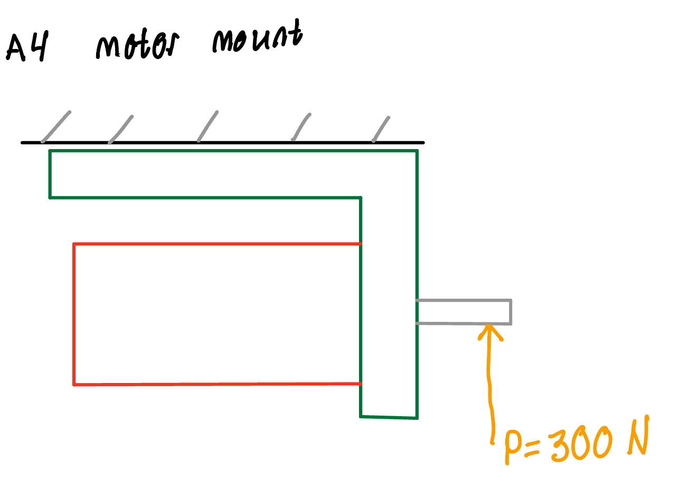
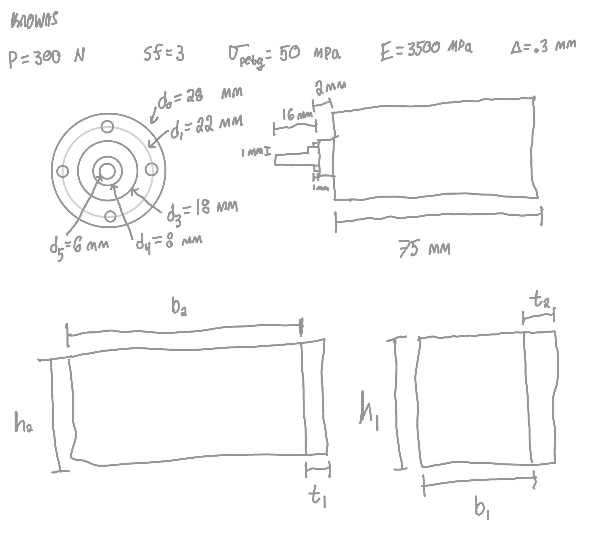
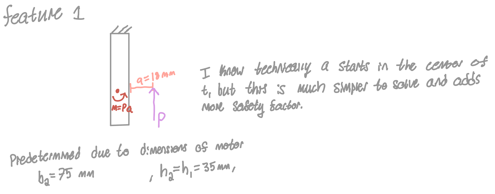
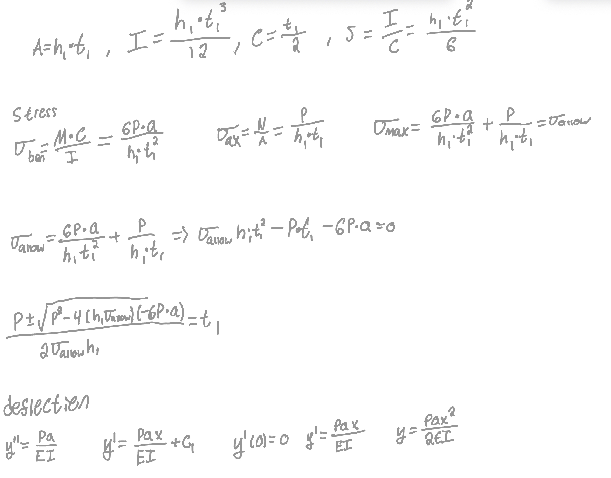
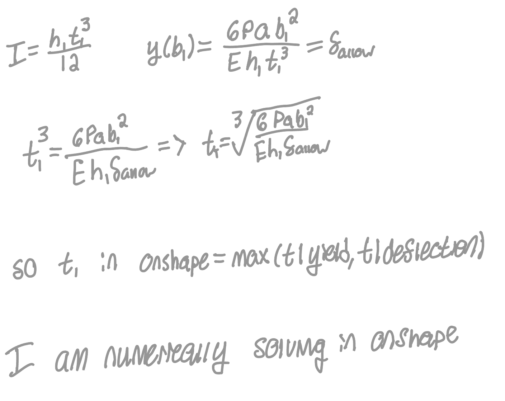
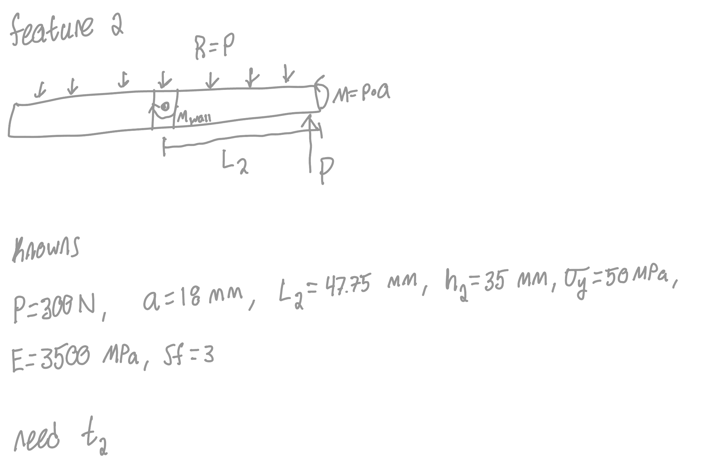
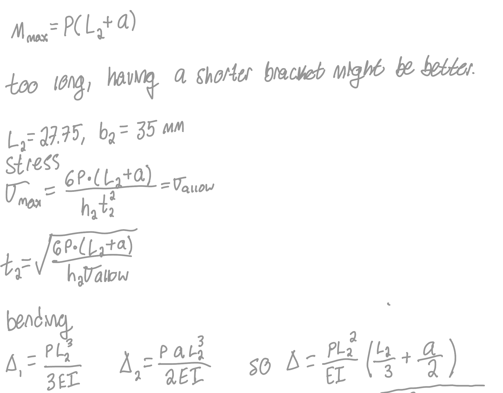
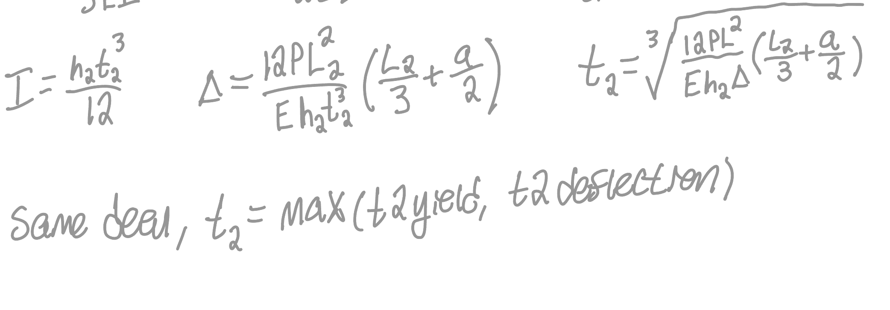

# A4 – Motor Mount Design

## Objective

<figure style="margin:1.6em 0; text-align:center;">
  
  <figcaption style="margin-top:.6em; font-size:.75rem; line-height:1.45; color:var(--md-default-fg-color--light);">The assignment brief and Figure 1 — the motor mount, the rigid wall, and the force P = 300 N received on the motor shaft.</figcaption>
</figure>

## Analyze

### Feature One

<figure style="margin:1.6em 0; text-align:center;">
  
</figure>

The first step to solving this problem was getting our unknowns together. I was given by the problem statement that P = 300 N, sf = 3, and delta = 0.3 mm. I found PLA yield stress to be 50 MPa and E to be 3500 MPa.

<figure style="margin:1.6em 0; text-align:center;">
  
  <figcaption style="margin-top:.6em; font-size:.75rem; line-height:1.45; color:var(--md-default-fg-color--light);">The motor's dimensions taken from its step file, with h1, h2, b1, b2, t1 and t2 assigned to the mount's feature dimensions.</figcaption>
</figure>

Going to the step file for the listed motor, I was able to get dimensions for it. I also needed to assign variables to the dimensions of the mount. I went with h1 and h2 being the depth from the side view, b1 and b2 being the length of the longest part of each feature when looking from the side view, and t1 and t2 being the thicknesses of the features.

<figure style="margin:1.6em 0; text-align:center;">
  
  <figcaption style="margin-top:.6em; font-size:.75rem; line-height:1.45; color:var(--md-default-fg-color--light);">Free body diagram of feature one, fixed at the top, with moment M = Pa and the load P acting at distance a = 18 mm.</figcaption>
</figure>

Starting with feature one, I first needed to draw a free body diagram to understand how the forces interact within the member. We are acting as if there is a fixed constraint at the top of it because feature two is fixed for the purposes of the problem. I went ahead and assigned b2 to be 75 mm and h1 and h2 to be 35 mm, due to the motor dimensions. b2 is overkill, so if it becomes an issue later I will reassess. I also assigned a to be the distance from the mount that force P is acting on. Technically this dimension should be from the center of t1, but I am pretty sure that doing it like that changes the math a lot, with a becoming 18 - t1/2, and leaving it simply at 18 mm just adds an extra safety cushion.

<figure style="margin:0;"><figcaption style="margin-top:.45em; font-size:.72rem; line-height:1.4; text-align:center; color:var(--md-default-fg-color--light);">Stress and deflection equations, solving for the allowable stress and rearranging for t1.</figcaption></figure><figure style="margin:0;"><figcaption style="margin-top:.45em; font-size:.72rem; line-height:1.4; text-align:center; color:var(--md-default-fg-color--light);">Deflection equation solved for t1, with the plan to numerically solve for t1 in Onshape.</figcaption></figure>

I solved for both stress and bending with equations. I was confused about how the force P would interact with bending of the beam until I realized it was just a bending moment. Once that was understood, I was able to find equations that would return t1 (the one unknown for feature one).

### Feature Two

<figure style="margin:0;"><figcaption style="margin-top:.45em; font-size:.72rem; line-height:1.4; text-align:center; color:var(--md-default-fg-color--light);">Free body diagram of feature two, showing the reaction R = P, the wall moment, the load P, and the known values for the beam.</figcaption></figure><figure style="margin:0;"><figcaption style="margin-top:.45em; font-size:.72rem; line-height:1.4; text-align:center; color:var(--md-default-fg-color--light);">Stress equations for feature two, solving for t2 from the allowable stress after finding the original bracket length too long.</figcaption></figure><figure style="margin:0;"><figcaption style="margin-top:.45em; font-size:.72rem; line-height:1.4; text-align:center; color:var(--md-default-fg-color--light);">Deflection equation solved for t2, with t2 taken as the max of the yield and deflection results.</figcaption></figure>

Feature two was pretty simple — it just needed a predetermined bolt axis to put the moment around. I chose to shorten feature two as I realized that the bolts were better off being closer to feature one. I decided I would make feature one and two equivalent (disregarding that feature two technically includes t1). This put the bolts at 27.76 mm from the front of the bracket. When I put this into my Onshape variable table to solve, the thickness of part two was just barely governed by the yield strength.

### CAD

<figure style="margin:0;"><figcaption style="margin-top:.45em; font-size:.72rem; line-height:1.4; text-align:center; color:var(--md-default-fg-color--light);">Onshape variable table, part 1 — inputs for the load, safety factor, material properties, deflection limit, motor dimensions, and feature depths and lengths.</figcaption></figure><figure style="margin:0;"><figcaption style="margin-top:.45em; font-size:.72rem; line-height:1.4; text-align:center; color:var(--md-default-fg-color--light);">Onshape variable table, part 2 — the solved a, t1, and t2 values along with the hole clearance dimensions.</figcaption></figure>

I first made the variable table. I wasn't exactly sure what I needed, so I went on the side of excess. You can't see the equations in this view, but they are the same as what is written in the symbolic work.

<figure style="margin:0;"><figcaption style="margin-top:.45em; font-size:.72rem; line-height:1.4; text-align:center; color:var(--md-default-fg-color--light);">Sketch of the bracket profile, a small rectangle set inside a larger rectangle, dimensioned with b2, t1, and h1.</figcaption></figure><figure style="margin:0;"><figcaption style="margin-top:.45em; font-size:.72rem; line-height:1.4; text-align:center; color:var(--md-default-fg-color--light);">Feature 2 extrude, taking the whole sketch out by t2.</figcaption></figure><figure style="margin:0;"><figcaption style="margin-top:.45em; font-size:.72rem; line-height:1.4; text-align:center; color:var(--md-default-fg-color--light);">Feature 1 extrude, adding the small rectangle out the opposite direction by b1.</figcaption></figure><figure style="margin:0;"><figcaption style="margin-top:.45em; font-size:.72rem; line-height:1.4; text-align:center; color:var(--md-default-fg-color--light);">The bolt holes added through feature two on the construction line.</figcaption></figure><figure style="margin:0;"><figcaption style="margin-top:.45em; font-size:.72rem; line-height:1.4; text-align:center; color:var(--md-default-fg-color--light);">The motor boss and its four 3.4 mm mounting holes added to the face of feature one.</figcaption></figure>

I started the physical part of the CAD by making a simple sketch of a rectangle inside of a rectangle. I dimensioned the length of the big rectangle to be equal to b2, the thickness of the small one to be t1, and the width of both to be h1. I then extruded the whole thing in one direction by t2 and just the small rectangle in the opposite direction by b1. This gave me a rough bracket, and all I needed to add were the bolt holes. I added a construction line across the center of feature two and put two 4 mm holes through it. I then went to the face of feature one and added a big circle for the motor boss to fit through and holes for the motor to mount on at 3.4 mm. This is now a complete bracket. Most of the work for this assignment was in the numeric solving, which was a nice change from how I normally approach problems.

## Time Spent

I spent about eight hours on this assignment.

## AI Disclosure

Claude was used to lay out this page — placing the figures, writing the image captions, adding the section headings, and adding the front matter that drives the homepage card. The design, the hand calculations, and the CAD and Onshape variable table work are mine; no engineering content was produced by the model. Session summaries are on the [AI Disclosure](../../ai-disclosure.md) page.
