# A5 – Five-Member Bracket Design

## Objective

Size the five members (A–E) of a bracket assembly so each one survives a maximum applied force F = 800 lbf with a safety factor of 4, while keeping deflection under the given limit and respecting the fixed dimensions that were already toleranced.

## Analyze

### Knowns and Unknowns

<figure style="margin:1.6em 0; text-align:center;">
  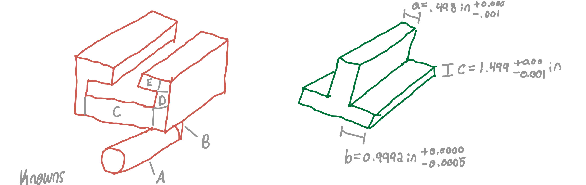
  <figcaption style="margin-top:.6em; font-size:.75rem; line-height:1.45; color:var(--md-default-fg-color--light);">The bracket assembly sketched in red with members A through E labeled, and the toleranced ideal geometry sketched in green with dimensions a, b, and Ic called out.</figcaption>
</figure>

The first step in approaching this problem was getting a hold of our knowns and unknowns. I decided to use the maximum force F of 800 lbf. A safety factor of four and a maximum deflection of .005 inches were given. I then looked for properties of the material options. I went ahead and included the safety factor into the allowable stress. The unknowns at this point were pretty vast as very little was defined dimension wise.

### Diagrams

<figure style="margin:1.6em 0; text-align:center;">
  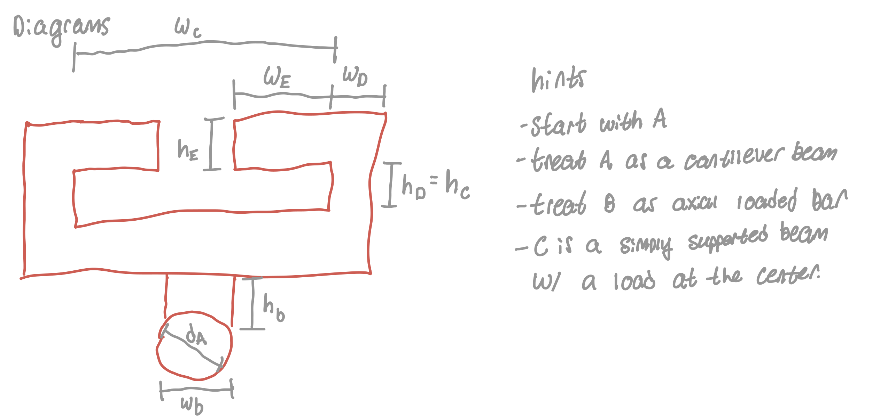
  <figcaption style="margin-top:.6em; font-size:.75rem; line-height:1.45; color:var(--md-default-fg-color--light);">Labeled diagram of the assembly's widths and heights, with hints on how to model members A, B, and C.</figcaption>
</figure>

I then needed to get my bearings before starting to solve algebraically. I labeled dimensions other than the length because that was uniform across every member. I also wrote down the hints given in the assignment description to help avoid unnecessary considerations when solving.

### Member A

<figure style="margin:0;">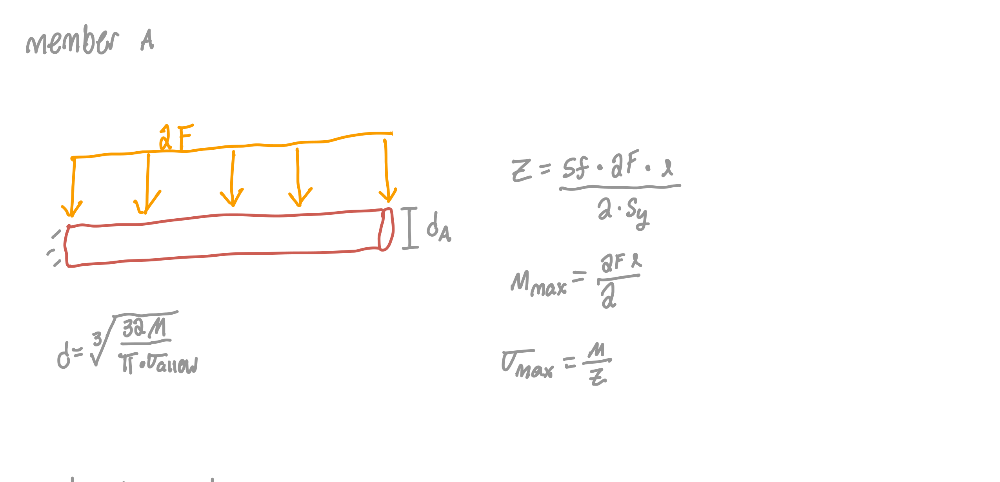<figcaption style="margin-top:.45em; font-size:.72rem; line-height:1.4; text-align:center; color:var(--md-default-fg-color--light);">Member A modeled as a cantilever beam under a distributed load 2F, solved algebraically for diameter dA from bending stress.</figcaption></figure><figure style="margin:0;">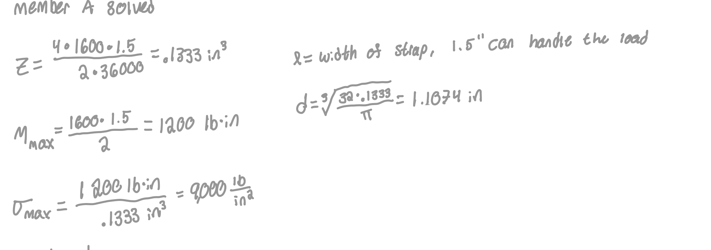<figcaption style="margin-top:.45em; font-size:.72rem; line-height:1.4; text-align:center; color:var(--md-default-fg-color--light);">Member A solved numerically for a 1.5 inch strap width, giving a diameter of 1.1074 inches.</figcaption></figure>

Solving for member A, I pulled a length l that fit a 1.5 inch strap which is enough to hold the load. I solved some things numerically that could have been left alone until the final form but nonetheless I got a diameter of 1.1074 inches with stress being the larger of the two.

### Member B

<figure style="margin:0;">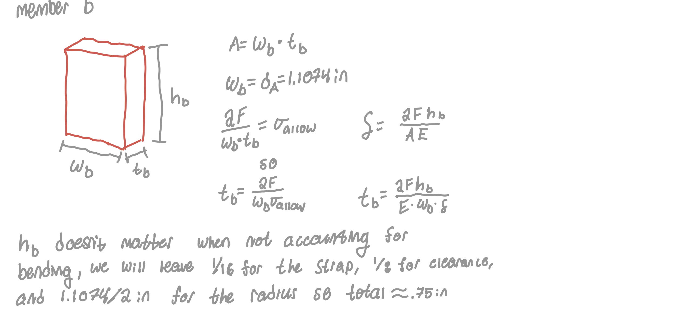<figcaption style="margin-top:.45em; font-size:.72rem; line-height:1.4; text-align:center; color:var(--md-default-fg-color--light);">Member B modeled as an axially loaded bar, solved algebraically for thickness tb from stress and stiffness.</figcaption></figure><figure style="margin:0;">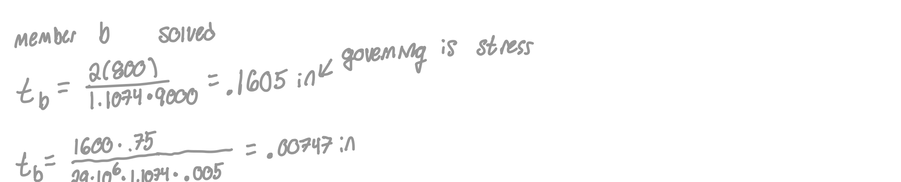<figcaption style="margin-top:.45em; font-size:.72rem; line-height:1.4; text-align:center; color:var(--md-default-fg-color--light);">Member B solved numerically, with stress governing at a thickness of .1605 inches.</figcaption></figure>

When solving for b, I assigned wb to be equal to d and h just needed to be rA + tol + strap thickness which worked out to just about .75 inches. At the end, tb worked out to be .1605 inches with stress being the governing failure mode.

### Member C

<figure style="margin:0;">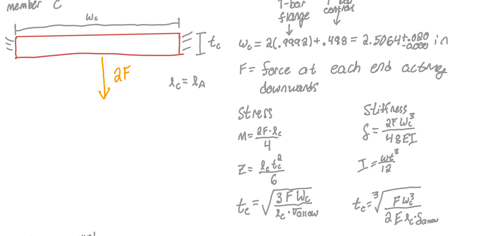<figcaption style="margin-top:.45em; font-size:.72rem; line-height:1.4; text-align:center; color:var(--md-default-fg-color--light);">Member C modeled as a simply supported beam with a center load 2F, solved algebraically for thickness tc from stress and stiffness.</figcaption></figure><figure style="margin:0;">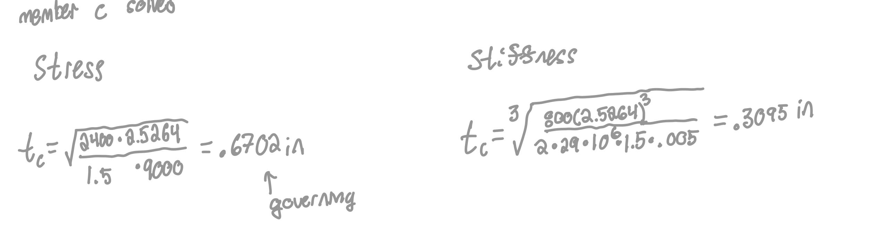<figcaption style="margin-top:.45em; font-size:.72rem; line-height:1.4; text-align:center; color:var(--md-default-fg-color--light);">Member C solved numerically, with stress governing at a thickness of .6702 inches.</figcaption></figure>

Solving for member C, I gave slip tolerance to the width, la = lc which I now realize should be lc + tb but that can be an added safety factor throughout. tc ended up being .6702 inches with stress being the governing equation.

### Member D

<figure style="margin:0;">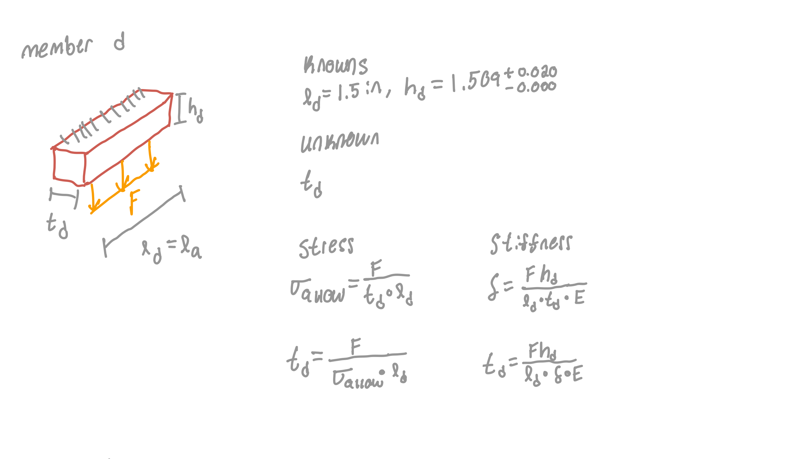<figcaption style="margin-top:.45em; font-size:.72rem; line-height:1.4; text-align:center; color:var(--md-default-fg-color--light);">Member D's knowns and unknowns, solved algebraically for thickness td from stress and stiffness.</figcaption></figure><figure style="margin:0;">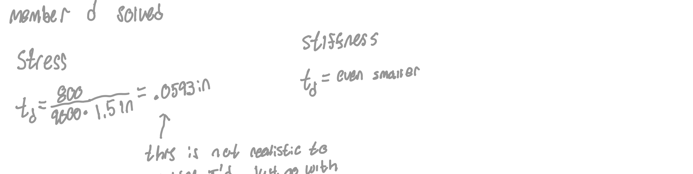<figcaption style="margin-top:.45em; font-size:.72rem; line-height:1.4; text-align:center; color:var(--md-default-fg-color--light);">Member D solved numerically for stress only, giving an unrealistically small .0593 inches, rounded up to .125 inches for machining.</figcaption></figure>

We know ld is 1.5 inches (really 1.5 + .1605 inches). I also have deduced at this point given how similar many of the load situations were that stiffness was not going to be the governing equation so I only numerically solved for stress. This gave me a thickness of .0593 inches which is ridiculously small so I went with .25 inches instead to make machining more realistic.

### Member E

<figure style="margin:0;">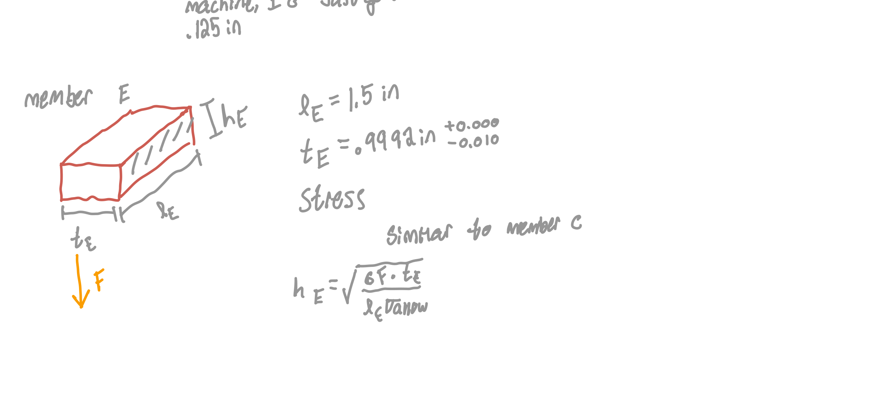<figcaption style="margin-top:.45em; font-size:.72rem; line-height:1.4; text-align:center; color:var(--md-default-fg-color--light);">Member E's knowns, solved algebraically for height hE using the same approach as member C.</figcaption></figure><figure style="margin:0;">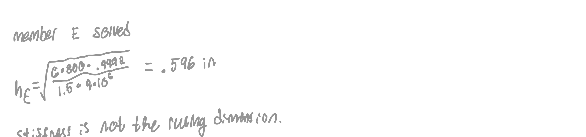<figcaption style="margin-top:.45em; font-size:.72rem; line-height:1.4; text-align:center; color:var(--md-default-fg-color--light);">Member E solved numerically, giving a height of .596 inches, with stiffness confirmed as not the ruling dimension.</figcaption></figure>

To solve member E, I needed hE. I had tE of about .9992 with a tolerance of -.01 inches. This allowed for a slip fit but the tolerancing was already dealt with by wc so it didn't need the same .01 to .03 that I had been using. .01 in should still be plenty achievable with a modern machine. The final dimension solved for was .596 inches and thus I had all I needed to CAD the part.

## Hand Drawings

<figure style="margin:1.6em 0; text-align:center;">
  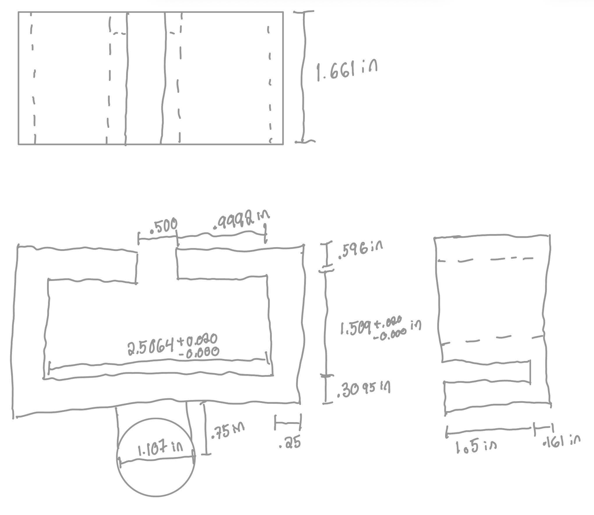
  <figcaption style="margin-top:.6em; font-size:.75rem; line-height:1.45; color:var(--md-default-fg-color--light);">Hand-drawn final dimensions for the stiffness-driven features, each toleranced.</figcaption>
</figure>

These drawings depict the dimensions I found for stiffness. They define all dimensions with tolerances where needed however I might change them for a machining drawing to use better reference points to get calipers around.

## Time Spent

I spent a total of six hours on this assignment, I wish I had more time to put into it as I think there are some failure modes that would be interesting to look into.

## Lessons Learned

Stress was the governing failure mode for almost everything. This might be pretty typical for a metal like steel. The biggest source of error in my analysis was likely forgetting to add tb into lc,d,and e. This produced an error that was safer than what was solved for and given that the values seemed reasonable I decided to leave it. In solving for dimensions, I assumed that bending was not an issue in member b however I think that would be one of the most risky components so it would be important to do that calculation before looking to produce this part.

## AI Disclosure

Claude was used to lay out this page — placing the figures, writing the image captions, adding the section headings, and adding the front matter that drives the homepage card. The design, the hand calculations, and the hand drawings are mine; no engineering content was produced by the model. In this conversation, Claude split my written-work PDF into the twelve section images used above and laid out the Objective and Analyze sections with my captions, then, in a follow-up, replaced the placeholder Decide/Communicate headings with the Hand Drawings, Time Spent, Lessons Learned and this AI Disclosure section from text I provided, and added the front matter above. Session summaries are on the [AI Disclosure](../../ai-disclosure.md) page.
